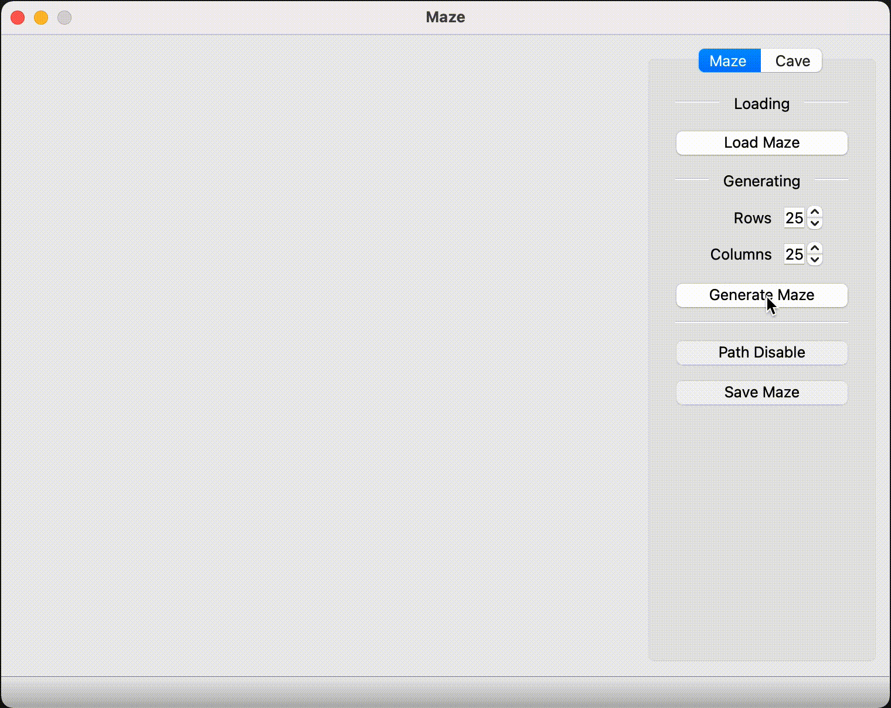
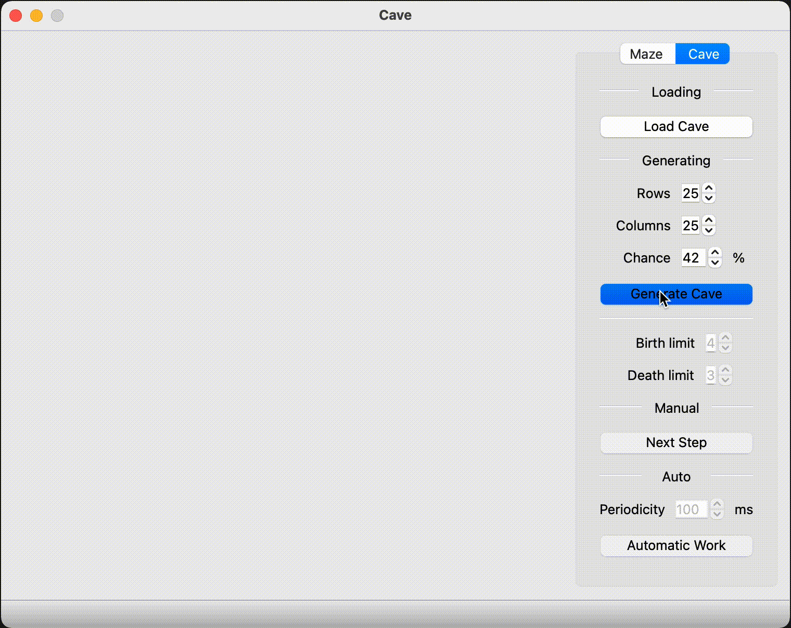

# Maze and Cave

The "Maze and caves" is a modern app written in C++. The application generates and views 2D models of mazes and caves, loaded from files that can be viewable on the screen with the ability to solve maze and cellular automaton caves generation.

## Table of Contents

- [Description](#description)
    - [Maze](#maze)
    - [Cave](#cave)
- [Getting Started](#getting-started)
    - [Dependenses](#dependencies)
    - [Installing](#installing)
    - [Usage](#usage)
- [Authors](#authors)
- [License](#license)
<!-- - [Acknowledgments](#acknowledgments) -->

## Description

- The program is developed in C++17.
- The code follows the Google Style guide.
- Full unit test coverage is prepared using the GTest library for expression calculation modules.
- The graphical interface implementation is based on the Qt library.
- The program is implemented using the MVC pattern.

### Maze

- Implement Eller's algorithm to automatically generate a perfect maze with no isolations or loops. 
- Allow the user to input the maze dimensions (number of rows and columns). 
- The user can select the beginning and end of the path with mouse clicks or moves.
- The shortest route will be automatically built.
- Save the generated maze in the specified file format.
- Load maze from the specified file format.

### Cave

- If "live" cells are surrounded by "live" cells, the number of which is less than the "death" limit, they "die". In the same way, if "dead" cells are next to "live" cells, the number of which is greater than the "birth" limit, they become "live".
- The "birth" and "death" limits can have values from 0 to 7.
- Cells outside the cave are considered alive
- There is a step-by-step mode for drawing the results of the algorithm in two versions:
    - Clicking the next step button leads to the rendering of the next iteration of the algorithm.
    - Pressing the automatic operation button starts drawing iterations of the algorithm with a frequency of 1 step per N milliseconds, where the number of milliseconds N is set through a special field in the user interface.
- Save the generated cave in the specified file format.
- Load cave from the specified file format.

## Getting Started

### Dependencies

- MacOS or Linux
- C++17 compiler
- QT5 or QT6

### Installing

To build and install this project, please follow the instructions below:
1. Clone this repository to your local machine.
2. Open a terminal and navigate to the project directory.
3. Run: `make install`.
4. This command will compile the source code and create an executable file named "Maze" in the build directory.

### Usage

- Run the `Maze` application

## Authors

- [Sergey Sinitsyn](https://github.com/SergSinitsyn) (aka Bernarda Verla): GUI
- [Sergey Gorbatenko](https://github.com/sg41) (aka Joelle Bonza): Cave logic, Maze path finding
- [Aleksandr Didenko](https://github.com/quincshe) (aka Quinc Sherley): Maze logic

## License

This project is licensed under the MIT License - see the [LICENSE](LICENSE.txt) file for details.

<!-- ## Acknowledgments -->

© 2023 SergSinitsyn
